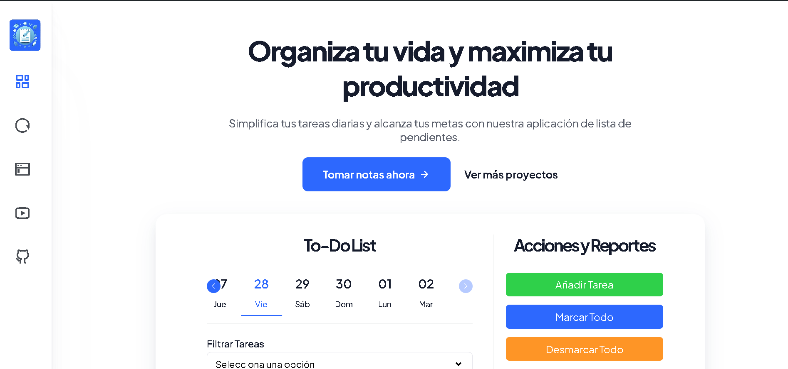
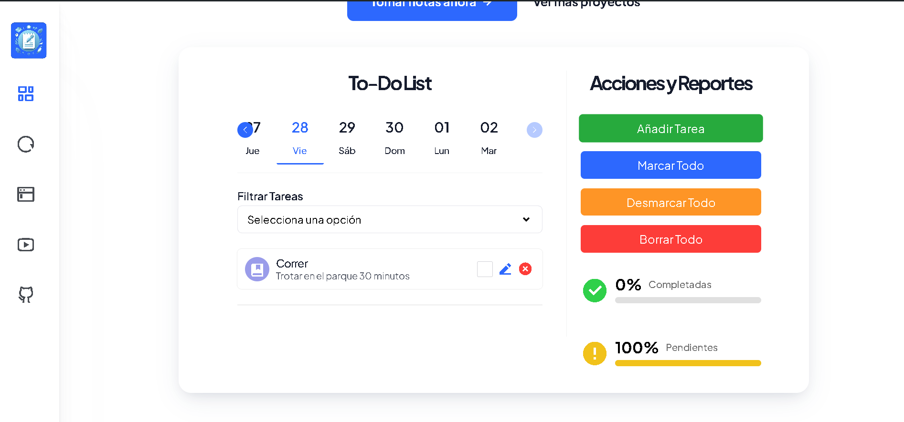

# Taskie To-Do List

**Taskie** es una aplicación de lista de tareas (to-do list) diseñada para mejorar la eficacia y productividad de las personas en su día a día. Desarrollada con tecnologías web estándar como HTML, CSS y JavaScript, Taskie utiliza **IndexedDB** para almacenar datos de forma local, garantizando que tus tareas estén siempre disponibles y con un rendimiento en la web óptimo. Con una interfaz intuitiva y una serie de funcionalidades útiles, Taskie te ayudará a llevar un registro organizado de tus actividades diarias, permitiéndote gestionar tus tareas de manera eficiente y efectiva.

## Demo

[Demo](https://taskietodo.vercel.app)

## Screenshots

## Features

- **Registro Organizado por Días:** Lleva un registro organizado separado por días sobre las actividades a realizar.
- **Agregar o Crear Nuevas Tareas:** Añade nuevas tareas de manera rápida y sencilla.
- **Editar Tareas:** Modifica las tareas existentes para mantener la información actualizada.
- **Filtrar Tareas:** Filtra tus tareas para ver solo las que te interesan.
- **Cambiar el Estado de una Tarea:** Marca las tareas como completadas o pendientes según sea necesario
- **Eliminar una Tarea:** Borra las tareas que ya no necesites.
- **Marcar Todas las Tareas:** Marca todas las tareas como completadas de una sola vez.
- **Desmarcar Todas las Tareas:** Desmarca todas las tareas para reiniciar el progreso.
- **Borrar Todas las Tareas:** Elimina todas las tareas para comenzar de nuevo.
- **Progreso de cumplimiento:** Observa el porcentaje de cumplimiento o incumplimiento para tus tareas

## Tech Stack

**Frontend:** HTML, CSS y Javascript

**Almacenamiento:** Indexed DB

## Documentación

[Documentación](https://harsh-weather-1fa.notion.site/Descripci-n-del-Proyecto-f768f53501114de691cf985bee5b5ef1)

